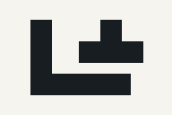
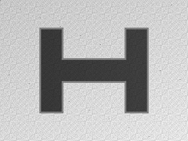
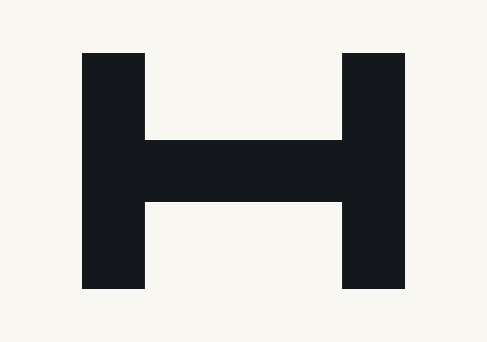

# Raster fixtures

`m07-raster-trace-goldens.json` pins the reviewed M07 fixture files, SHA-256
hashes, preprocessing settings, exact millimeter paths, node counts,
downsampling dimensions, warning codes, and speckle-removal evidence. All
artwork is original, unbranded, and reproducibly generated from
`scripts/generate-m07-raster-fixtures.cjs` with the pinned Electron runtime.

Reviewed source evidence:

- `m07/clean-logo.png` - crisp 192 x 128 geometric mark;
- `m07/clean-logo.jpg` - real JPEG encoding of that mark for native decode;
- `m07/noisy-photo.png` - 320 x 240 grayscale illumination falloff, sensor
  noise, edge shadow, and 17 isolated dust islands;
- `m07/anti-aliased-text.png` - 256 x 128 original glyph construction with
  deterministic 4 x 4 subpixel coverage and intermediate edge values;
- `m07/high-resolution-logo.png` - 2560 x 1800 (4.608 megapixels), which exceeds
  the four-million-pixel trace boundary and downscales to 2385 x 1677.

The packaged Windows tests trace both the committed PNG and committed JPEG
through Electron's real `nativeImage` decoder. No source path or pixel buffer
crosses renderer IPC.
